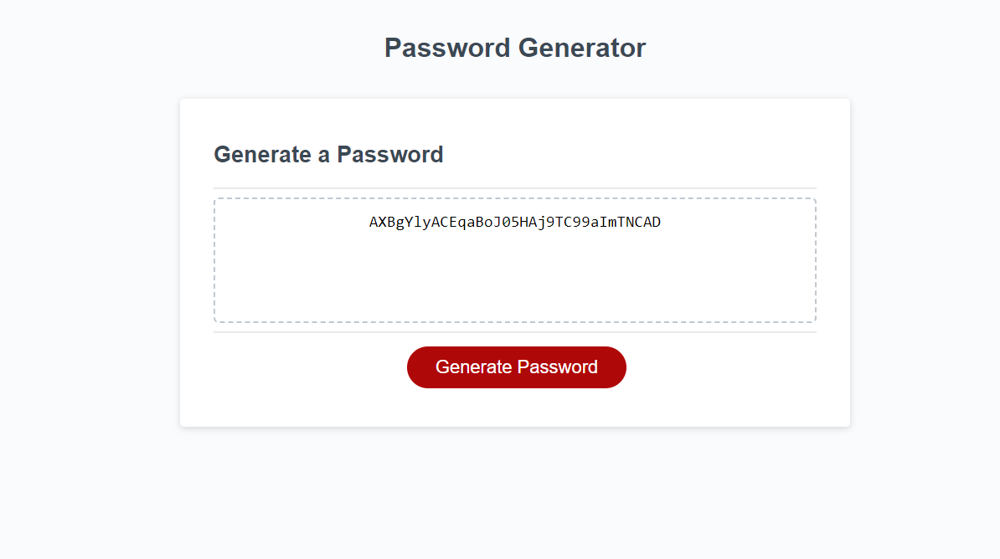

# Javascript Password Generator

## Description

The following repository contains all the code needed to create a fully functional password generator program in a webbrowser page. Through the power of javascript, users will be able to be walked through the steps to generate a random password, using criteria of their own desire, so that they may have a strong password down the line.

## Installation

No installation required, code runs fully within the browser, or launched from the index.html locally.

## Usage

    By opening the webpage and pressing the large "Generate" button, a series of prompts will occur, asking for length of a password, whether or not to include lowercase, UPPERCASE, numbers or special characters. With valid input, a randomly generated password will appear in the box on screen. Invalid inputs will be caught by the program and the user will be prompted to either correct the mistake, or should they choose, to terminate the program so users are not trapped in a forced loop.

    Link:

    Screenshot of the repo in use:
    
    
    
